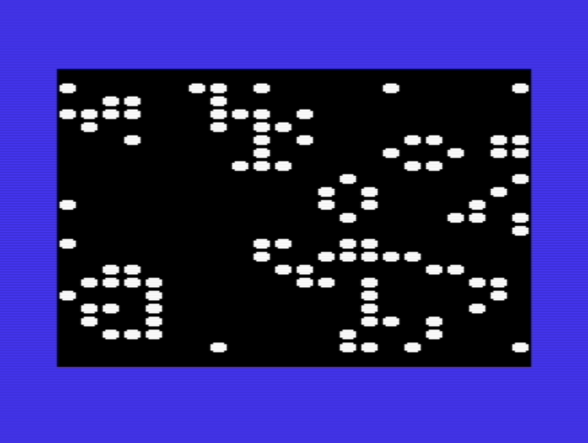
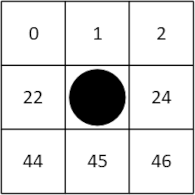
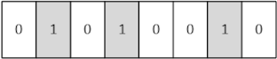
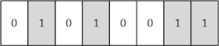
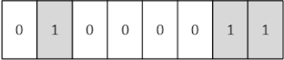

# VIC-20 Game of Life

This project is Conway's Game of Life for the unexpanded Commodore VIC-20.
It is written in assembler for [CA65](https://cc65.github.io/doc/ca65.html).

Every cell in the Game of Life is subject to three rules:

1. A dead cell becomes alive if it has exactly three neighbours.
2. A living cell dies if it has less than two neighbours.
3. A living cell continues to live if it has two or three neighbours.
4. A living cell dies if it has four or more neighbours.

The screen is populated using the **RND** kernel function ($E094) to determine
the spacing between living cells. **RND** expectes the seed to be a float in
$8B to $8F and writes a float to **FAC1** ($61). Reading the middle byte of the
returned value as an integer works well enough for this applicaiton.

The mighy VIC-20's screen in 22 by 23 characters. Starting from the
**north-west** neighbour as zero, the memory offsets for reading the state of a
given cell's neighbours are as follows:

Starting from zero for the north-west neighbour makes the look ups simpler
because the 6502 doesn't allow for negative indexing using the **X** and **Y**
index registers. The offsets are stored in **NEIGHBOUR_IDX** and are used to
look up the neighbour state for each cell on the screen.

Assessing the next state for a cell is done by using the current status of the
cell and the number of its neighbours to constuct a token to describe its state.
The token is eight bits: the four high bits descrive the current state, the low
bits are the number of neighbors. Once constructed the token is easily compared
with **OUTCOMES**, pre-generated tokens that indicate a cell should live on in
the next iteration.

Currently alive, with two neighbours:

Currently alive with three neighbours:

Currently dead with three neighbours:

## Bugs and Limitations

* Not tested on real hardware.
* Not synched to video, so there can be flicker.
* Probably an off-by-one error lurking in there somewhere.
